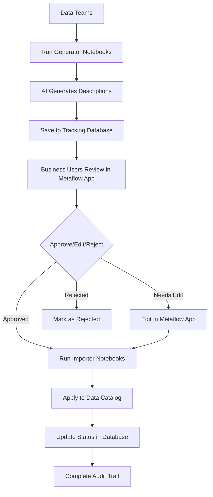

# Metadata Enrichment Tracker

A comprehensive Streamlit application for tracking bulk-generated metadata enrichment (comments and descriptions) in Databricks environments. This app allows business users to view, edit, and approve AI-generated metadata for database tables and columns.

## 📁 Project Structure

```
MetaFlow/
├── app/                          # Streamlit Application
│   ├── app.py                   # Main Streamlit application
│   ├── utils.py                 # Utility functions for the app
│   ├── requirements.txt         # Python dependencies
│   └── databricks_app.yml       # Databricks Apps configuration
├── database/                     # Database Layer
│   ├── database.py              # Database models and operations
│   └── generate_sample_data.py  # Sample data generator
├── code/                        # Databricks Notebooks
│   ├── bulk_column_description_generator.py
│   ├── bulk_table_description_generator.py
│   ├── bulk_column_description_importer.py
│   └── bulk_table_description_importer.py
├── config.py                    # Configuration management
├── setup.py                    # Automated setup script
├── test_installation.py        # Installation verification
├── INTEGRATION_SUMMARY.md      # Complete project overview
└── README.md                   # This file
```

## 🚀 Features

- **📊 Dashboard**: Overview of metadata items with status tracking and analytics
- **✅ Review & Approve**: Interface for business users to review and approve generated metadata
- **📤 Bulk Upload**: CSV-based bulk import of metadata items
- **📜 History Tracking**: Complete audit trail of all changes and approvals
- **🤖 AI Integration**: OpenAI GPT integration for automated metadata generation
- **🔧 Databricks Native**: Designed specifically for Databricks Apps environment
- **🗄️ PostgreSQL Backend**: Uses Databricks Lakebase (Postgres) for data storage

## 🔄 Complete Workflow



## 🛠️ Quick Start

### 1. Installation

```bash
# Clone or download the project
cd Metaflow

# Run automated setup (installs from app/requirements.txt)
python setup.py

# Test installation
python test_installation.py
```

### 2. Configuration

Update the `.env` file created by setup:

```bash
# Database settings (for Lakebase/Postgres)
DB_HOST=your-postgres-host
DB_PORT=5432
DB_NAME=your-database-name
DB_USER=your-username
DB_PASSWORD=your-password
DB_SCHEMA=metadata_enrichment

# Optional: Databricks connection settings
DATABRICKS_SERVER_HOSTNAME=your-workspace.cloud.databricks.com
DATABRICKS_HTTP_PATH=/sql/1.0/warehouses/your-warehouse-id
DATABRICKS_ACCESS_TOKEN=your-access-token
```

### 3. Run the Application

```bash
# Start the Streamlit app
streamlit run app/app.py

# Or for Databricks Apps deployment
# Upload files and deploy using app/databricks_app.yml
```

## 📋 Usage Guide

### For Data Teams (Generation)

1. **Upload Notebooks** to Databricks workspace:
   - `code/bulk_table_description_generator.py`
   - `code/bulk_column_description_generator.py`

2. **Configure and Run Generators**:
   - Set catalog/schema names
   - Provide OpenAI API key
   - Run notebooks to generate descriptions

3. **Monitor Progress** in Streamlit dashboard

### For Business Users (Review)

1. **Open Streamlit App** and navigate to "Review & Approve"
2. **Filter** by catalog, schema, table, or status
3. **Review** AI-generated descriptions
4. **Edit** descriptions if needed
5. **Approve** or **Reject** items
6. **Add comments** for context

### For Data Teams (Import)

1. **Run Importer Notebooks** after approval:
   - `code/bulk_table_description_importer.py`
   - `code/bulk_column_description_importer.py`

2. **Use Dry Run** mode first to preview changes
3. **Apply** approved descriptions to data catalog
4. **Verify** changes in your data catalog interface

## 🗄️ Database Schema

### Enhanced `metadata_items` Table
- `id`: Primary key
- `catalog_name`, `schema_name`, `table_name`: Three-part naming
- `column_name`: Column name (NULL for table-level metadata)
- `metadata_type`: 'comment' or 'description'
- `original_value`: Original metadata value
- `generated_value`: AI-generated metadata value
- `current_value`: Current approved/edited value
- `status`: 'pending', 'approved', 'rejected', 'edited'
- `generation_method`: AI model used ('openai_gpt4', etc.)
- `generation_prompt`: Prompt used for generation
- `generation_metadata`: JSON with costs, tokens, etc.
- `data_sample`: Sample data used for generation
- Timestamps and user tracking fields

### `approval_history` Table
- Complete audit trail of all changes
- Action tracking (approved, rejected, edited, imported)
- User attribution and timestamps
- Comments and change details


## 🔧 Configuration Options

### Application Settings
- Database connection parameters
- AI model selection (GPT-4, GPT-3.5-turbo)
- Batch processing sizes
- Rate limiting settings

### Notebook Parameters
- Catalog and schema filtering
- Table name filters
- Sample data inclusion
- Dry run mode for importers

## 📊 Monitoring & Analytics

### Streamlit Dashboard
- Overall statistics and metrics
- Status distribution charts
- Recent activity timeline
- Success/failure rates

### Notebook Analytics
- Processing time per item
- Token usage and costs
- Quality metrics
- Error tracking and logging

## 🔐 Security & Compliance

### Data Protection
- Secure API key storage via environment variables
- Input validation and sanitization
- No PII exposure in sample data (configurable)
- Role-based access through Databricks workspace

### Audit & Compliance
- Complete change history in `approval_history` table
- User attribution for all actions
- Rollback capabilities with original value preservation
- Export functionality for compliance reporting

## 🚨 Troubleshooting

### Common Issues

1. **Module Import Errors**
   - Run `python test_installation.py` to diagnose
   - Check folder structure matches expected layout
   - Verify all files are in correct subdirectories

2. **Database Connection Failed**
   - Check `.env` file configuration
   - Verify database credentials and network access
   - Ensure schema exists and has proper permissions

3. **Notebook Path Errors**
   - Update `sys.path.append()` lines in notebooks
   - Use absolute paths in Databricks workspace

4. **Streamlit App Won't Start**
   - Run from project root: `streamlit run app/app.py`
   - Check all imports resolve correctly
   - Review error messages for missing dependencies

### Debug Mode
```bash
# Run with debug logging
streamlit run app/app.py --logger.level=debug

# Test specific components
python -c "from database.database import get_db_manager; print('DB OK')"
python -c "from app.utils import get_user_name; print('Utils OK')"
```

## 🔄 Deployment

### Local Development
```bash
streamlit run app/app.py
```

### Databricks Apps
1. Upload all files maintaining folder structure
2. Configure environment variables in Apps settings
3. Deploy using `app/databricks_app.yml` configuration
4. Access through Databricks Apps interface

## 📚 Additional Resources

- [Notebook Documentation](code/README.md) - Detailed notebook usage guide
- [Integration Summary](INTEGRATION_SUMMARY.md) - Complete technical overview
- [OpenAI API Documentation](https://platform.openai.com/docs)
- [Databricks SQL Reference](https://docs.databricks.com/sql/language-manual/index.html)