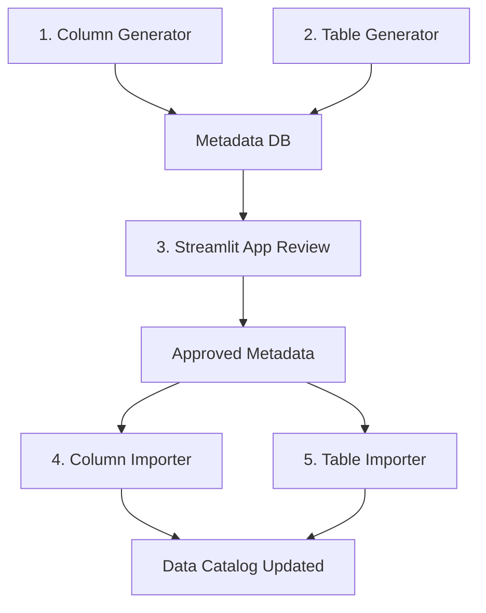

# Databricks Notebooks - Code Directory

This directory contains four Databricks notebooks that work together to generate and import AI-powered metadata descriptions for your data catalog. These notebooks integrate with the MetaFlow Streamlit app to provide a complete metadata enrichment workflow.

## 📋 Workflow Overview



## 📁 Notebook Files

### 1. `bulk_column_description_generator.py`
**Purpose**: Generate AI-powered descriptions for database columns

**What it does**:
- Scans specified catalog/schema for tables and columns
- Samples data from each column for context
- Uses OpenAI GPT models to generate business-friendly descriptions
- Saves generated descriptions to the metadata tracking database

**Key Features**:
- Configurable via widgets (catalog, schema, API key, model selection)
- Batch processing with rate limiting
- Cost estimation and token usage tracking
- Sample data inclusion for better context
- Comprehensive error handling and logging

**Prerequisites**:
- OpenAI API key
- Database connection configured
- Read access to target catalog/schema

### 2. `bulk_table_description_generator.py`
**Purpose**: Generate AI-powered descriptions for database tables

**What it does**:
- Scans specified catalog/schema for tables
- Analyzes table structure (columns, data types, row counts)
- Samples table data for context
- Uses OpenAI GPT models to generate table descriptions
- Saves generated descriptions to the metadata tracking database

**Key Features**:
- Table-level metadata generation
- Schema analysis integration
- Sample data inclusion
- Quality metrics and analysis
- Cost tracking and optimization

**Prerequisites**:
- OpenAI API key
- Database connection configured
- Read access to target catalog/schema

### 3. `bulk_column_description_importer.py`
**Purpose**: Import approved column descriptions to the data catalog

**What it does**:
- Queries approved column descriptions from tracking database
- Generates ALTER TABLE statements for column comments
- Applies descriptions to the actual data catalog
- Updates import status in tracking database
- Provides verification and rollback information

**Key Features**:
- Dry run mode for preview
- Batch processing for large datasets
- Table existence validation
- Comprehensive error handling
- Rollback instructions

**Prerequisites**:
- Approved column descriptions in tracking database
- ALTER TABLE permissions on target tables
- Database connection configured

### 4. `bulk_table_description_importer.py`
**Purpose**: Import approved table descriptions to the data catalog

**What it does**:
- Queries approved table descriptions from tracking database
- Generates ALTER TABLE statements for table comments
- Applies descriptions to the actual data catalog
- Updates import status in tracking database
- Provides verification and quality checks

**Key Features**:
- Table-level comment management
- Dry run capability
- Quality assurance checks
- Import verification
- Rollback support

**Prerequisites**:
- Approved table descriptions in tracking database
- ALTER TABLE permissions on target tables
- Database connection configured

## 🚀 Getting Started

### Step 1: Setup
1. Configure your database connection in the MetaFlow project
2. Ensure the Streamlit app is running
3. Obtain OpenAI API key
4. Set up appropriate permissions in Databricks

### Step 2: Upload to Databricks
1. Upload all `.py` files to your Databricks workspace
2. Update the `sys.path.append()` line in each notebook to point to your repo location
3. Ensure the parent MetaFlow directory is accessible

### Step 3: Generate Descriptions
1. Run `bulk_table_description_generator.py` first for table-level metadata
2. Run `bulk_column_description_generator.py` for detailed column metadata
3. Monitor costs and token usage in the notebook outputs

### Step 4: Review and Approve
1. Open the MetaFlow Streamlit app
2. Navigate to "Review & Approve" section
3. Review AI-generated descriptions
4. Edit, approve, or reject as needed
5. Add comments for context

### Step 5: Import to Catalog
1. Run `bulk_table_description_importer.py` to apply table descriptions
2. Run `bulk_column_description_importer.py` to apply column descriptions
3. Use dry run mode first to preview changes
4. Verify changes in your data catalog

## ⚙️ Configuration

### Widget Parameters

All notebooks use Databricks widgets for configuration:

| Parameter | Description | Default | Required |
|-----------|-------------|---------|----------|
| `catalog_name` | Target catalog name | "main" | Yes |
| `schema_name` | Target schema name | "default" | Yes |
| `table_filter` | Comma-separated table filters | "" | No |
| `openai_api_key` | OpenAI API key | "" | Yes (generators) |
| `openai_model` | GPT model to use | "gpt-4" | Yes (generators) |
| `dry_run` | Preview mode only | "Yes" | No (importers) |
| `batch_size` | Items per batch | varies | No |

### Environment Setup

Before running, update the path in each notebook:
```python
sys.path.append('/Workspace/Repos/your-repo/MetaFlow')  # Update this path
```

## 💰 Cost Management

### OpenAI API Costs
- **GPT-4**: ~$0.03 per 1K tokens
- **GPT-3.5-turbo**: ~$0.002 per 1K tokens
- Average column description: 100-200 tokens
- Average table description: 200-400 tokens

### Cost Optimization Tips
1. Start with smaller catalogs/schemas
2. Use GPT-3.5-turbo for initial testing
3. Filter tables to focus on important ones
4. Monitor token usage in notebook outputs
5. Use sample data judiciously (increases token count)

### Example Costs
- 100 columns with GPT-4: ~$0.30-$0.60
- 20 tables with GPT-4: ~$0.20-$0.40
- 1000 columns with GPT-3.5-turbo: ~$0.40-$0.80

## 🔧 Troubleshooting

### Common Issues

#### 1. Import Path Error
```python
ModuleNotFoundError: No module named 'database'
```
**Solution**: Update the `sys.path.append()` line with your correct repository path

#### 2. Database Connection Failed
```
Failed to create database tables
```
**Solutions**:
- Check database credentials in config
- Verify network connectivity
- Ensure schema exists and has proper permissions

#### 3. OpenAI API Errors
```
openai.error.RateLimitError
```
**Solutions**:
- Check API key validity
- Reduce batch size
- Increase delay between requests
- Verify API quota limits

#### 4. Permission Denied on ALTER TABLE
```
Failed to apply description: Permission denied
```
**Solutions**:
- Verify ALTER TABLE permissions
- Check table ownership
- Ensure catalog/schema access rights

#### 5. Table Not Found
```
Table not found: catalog.schema.table
```
**Solutions**:
- Verify table names and paths
- Check catalog/schema spelling
- Ensure tables haven't been dropped/renamed

### Debugging Tips

1. **Enable Debug Logging**:
   ```python
   logging.basicConfig(level=logging.DEBUG)
   ```

2. **Test with Small Batches**:
   - Set `max_tables = 1` initially
   - Use `table_filter` to target specific tables

3. **Use Dry Run Mode**:
   - Always test importers with `dry_run = "Yes"` first

4. **Check Widget Values**:
   ```python
   print(f"Catalog: {catalog_name}")
   print(f"Schema: {schema_name}")
   ```

## 📊 Monitoring and Analytics

### Notebook Outputs
Each notebook provides detailed statistics:
- Processing time per item
- Success/failure rates
- Token usage and costs
- Quality metrics

### Streamlit Dashboard
Monitor progress in the MetaFlow app:
- Overall statistics
- Status distribution
- Recent activity
- Approval rates

### Database Queries
Query the tracking database directly:
```sql
-- Check generation progress
SELECT status, COUNT(*) as count
FROM metadata_enrichment.metadata_items
GROUP BY status;

-- Monitor costs
SELECT 
    generation_method,
    AVG(JSON_EXTRACT(generation_metadata, '$.cost_estimate')) as avg_cost
FROM metadata_enrichment.metadata_items
WHERE generation_metadata IS NOT NULL
GROUP BY generation_method;
```

## 🔄 Best Practices

### Generation Phase
1. **Start Small**: Test with 5-10 tables first
2. **Review Prompts**: Customize prompts for your domain
3. **Monitor Costs**: Track token usage and API costs
4. **Quality Check**: Review sample outputs before bulk processing
5. **Rate Limiting**: Respect OpenAI API limits

### Review Phase
1. **Business User Training**: Train reviewers on the interface
2. **Approval Guidelines**: Create standards for good descriptions
3. **Batch Reviews**: Process similar tables together
4. **Feedback Loop**: Collect feedback to improve prompts

### Import Phase
1. **Always Dry Run**: Preview changes before applying
2. **Backup First**: Document original descriptions
3. **Batch Import**: Process in manageable batches
4. **Verify Results**: Check applied descriptions in catalog
5. **Rollback Plan**: Keep rollback scripts ready

## 🔐 Security Considerations

### API Keys
- Store OpenAI API keys securely
- Use Databricks secrets management
- Rotate keys regularly
- Monitor API usage

### Database Access
- Use least privilege principle
- Separate read/write permissions
- Audit database access
- Encrypt connections

### Data Privacy
- Review sample data exposure
- Consider PII in descriptions
- Implement data classification
- Follow compliance requirements

## 📚 Additional Resources

- [OpenAI API Documentation](https://platform.openai.com/docs)
- [Databricks SQL Reference](https://docs.databricks.com/sql/language-manual/index.html)
- [MetaFlow Streamlit App Documentation](../README.md)
- [Database Schema Reference](../database/database.py)

## 🤝 Contributing

To contribute improvements:
1. Test changes thoroughly
2. Update documentation
3. Follow existing code style
4. Add error handling
5. Include logging statements

## 📞 Support

For issues:
1. Check troubleshooting section
2. Review notebook outputs and logs
3. Test with minimal configuration
4. Check database and API connectivity
5. Contact your Databricks administrator
